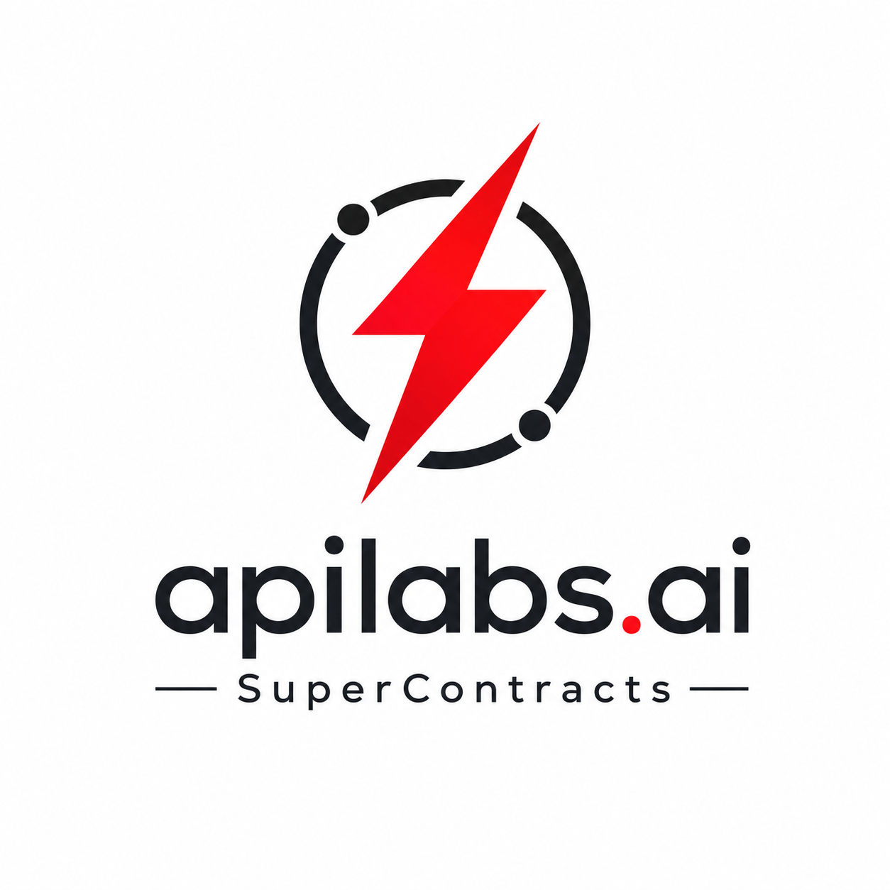

<p align="center">
  
</p>

<h1 align="center">SuperContracts</h1>

<p align="center">
  Executable contracts and guardrails for APIs, MCPs, and AI agents.
</p>

Open Contract Spec defines how software systems should be called, tested, secured, approved, and executed — in a format humans, tools, and AI agents can understand.

Traditional API specs describe endpoints.

**Open Contract Spec describes execution, policy, and safety.**

---

## Why

API operations are fragmented.

* **OpenAPI** documents endpoints.
* **Postman<sup>TM</sup>** tests requests.
* **CI** validates changes.
* **Workflow tools** automate actions.
* **Security tools** enforce policies.
* **Jira<sup>TM</sup>, Slack<sup>TM</sup>, and email** handle approvals.
* **Logs** capture audits.

The result is drift, duplicated work, weak governance, and unclear ownership.

That was inefficient for developers.
With AI agents and MCP tools executing real actions, it becomes a security risk.

Agents can touch money, data, code, infrastructure, and customer operations. Without guardrails, they can trigger unauthorized access, destructive changes, privilege misuse, prompt-injection exploits, or unapproved production actions.

**Open Contract Spec<sup>TM</sup> brings docs, tests, workflows, approvals, guardrails, and audit trails into one executable contract.**


---

## What It Covers

* APIs and MCP tools
* Auth and environments
* Workflows and tests
* Approvals and guardrails
* AI-agent permissions
* Runtime evidence

---

## Use Cases & Code Recipes

# SuperContracts MVP Core Capabilities

## Cursor™ MCP Integration & Runtime Evidence

Bring SuperContracts directly into Cursor™ through MCP, enabling developers and AI agents to discover, execute, test, and govern APIs and workflows from the IDE.

Every action captures requests, responses, policy decisions, approvals, actors, timestamps, and execution traces for auditability, compliance, monitoring, and debugging.

### Example 1

Ask Cursor™ to:

```text
Refund Stripe payment for Order #10482.
```

SuperContracts executes the workflow, requests approval if needed, performs the refund, and records the complete audit trail.

### Example 2

Ask Cursor™ to:

```text
Create a new Supabase table for feature flags.
```

SuperContracts validates the SQL, executes the migration, and records the executed SQL, user, timestamp, and result.

---

## AI Agent Guardrails

Define the systems, tools, data, and actions an AI agent is permitted to access.

These guardrails keep autonomous agents within approved boundaries and prevent unauthorized changes to enterprise systems.

### Example 1

Allow an AI support agent to read Stripe customer and subscription information, but prevent it from issuing refunds.

### Example 2

Allow an AI coding agent to create GitHub branches and pull requests, but prevent it from deploying changes to production.

---

## Cursor

Connect SuperContracts to Cursor through MCP so your AI agent can discover contracts, execute workflows, inspect test history, and receive auto-generated AI context — without leaving the IDE.

Every tool call runs through the same guardrails, approvals, and evidence capture defined in your contract.

### Connect in Cursor

1. Open **Cursor Settings → Features → MCP** and click **Add MCP Server**, or add a project-level `.cursor/mcp.json` file.
2. Download the SuperContracts MCP configuration from [supercontracts.dev](https://supercontracts.dev) using **Add to Cursor**, or paste the config below after starting the local MCP server:

```json
{
  "mcpServers": {
    "supercontracts": {
      "url": "http://127.0.0.1:8080/mcp"
    }
  }
}
```

3. Start the SuperContracts MCP server and authenticate with your apilabs.ai workspace. A green indicator in Cursor confirms the tools are discovered.

### Published MCP Tools

| Tool | Purpose |
| --- | --- |
| `list_contracts` | List saved contract YAML files in API Contract Model, including nested explorer folders |
| `get_contract` | Load the YAML content of a saved contract by `connection_id` |
| `save_contract` | Create or update a contract YAML file in API Contract Model |
| `run_contract` | Execute a contract inline — returns `run_id`, response, and optional AI context |
| `list_test_runs` | Browse recent contract test run history with archive and status filters |
| `get_test_run` | Fetch full run details including assertions, response body, and AI context |
| `resolve_resource` | Resolve an apilabs ARN (file, secret, or method) to metadata without exposing secrets |

**Typical flow:** `list_contracts` → `get_contract` → `run_contract` → `get_test_run`

When `generate_ai_context` is enabled on `run_contract`, SuperContracts produces an `ai_context.md` artifact summarizing execution results, policy decisions, failed assertions, and remediation hints — ready for the Cursor agent to reason over on the next turn.

### Working Demo

Watch the end-to-end Cursor MCP demo: test a workflow API from the IDE, execute the contract, and feed auto-generated AI context back to the agent.

**[Test Workflow APIs with AI Agent Contracts and Auto-Generated AI Context](https://youtu.be/GAt-V7jL4e0?si=lcWUECktH2ZkjOOw)**

In the demo, Cursor:

1. Calls `run_contract` with a SuperContracts YAML workflow.
2. Captures run artifacts — `run.json`, `response.json`, and `ai_context.md`.
3. Uses the generated AI context to explain failures, suggest fixes, and continue debugging — all inside the same chat.

---

## MCP Guardrails 

Control how AI models interact with Model Context Protocol tools.

SuperContracts acts as a policy-enforcement layer that blocks unauthorized, unsafe, or unverified tool calls before they reach connected systems.

### Example 1

Permit the GitHub MCP server to create branches and pull requests, but block direct pushes to the `main` branch.

### Example 2

Allow the Supabase MCP server to run `SELECT` queries while blocking `DROP TABLE` and unrestricted `DELETE` operations.

---

## Production Action Approval

Add human-in-the-loop controls for destructive, sensitive, or high-impact production actions.

Operations such as database migrations, bulk deletions, refunds, or infrastructure changes cannot proceed without explicit authorization.

### Example 1

Require Finance approval before executing Stripe refunds above `$500`.

### Example 2

Require Database Administrator approval before applying a migration to a production Supabase database.

---

## Slack™ Bot Guardrails

Control what Slack™ bots and AI agents can read, post, approve, and execute from conversations.

SuperContracts can restrict sensitive channels, block unauthorized commands, require approval for high-risk actions, validate the requesting user, and retain evidence of every bot-triggered operation.

### Example 1

An authorized finance user submits:

```text
/refund ORD-10482
```

SuperContracts validates the user and starts the Stripe refund workflow.

### Example 2

A user submits:

```text
/deploy production
```

SuperContracts requires Release Manager approval before triggering the GitHub Actions deployment.

---

## API Workflow Testing & Execution

Centralize API behavior, dependencies, conditions, tests, and workflow steps in a single executable contract.

This eliminates fragmented scripts and helps multi-step workflows run predictably and consistently.

### Example 1

Test a customer onboarding workflow that:

1. Creates a user in Supabase.
2. Creates a Stripe subscription.
3. Sends a welcome email through SendGrid.
4. Verifies the response from every API.

### Example 2

Execute an order-fulfillment workflow that:

1. Retrieves the order.
2. Validates inventory.
3. Charges the customer through Stripe.
4. Creates the shipment through Shippo.
5. Updates the order status.


## Implementation

Open Contract Spec is being implemented in **SuperContracts from [apilabs.ai](https://apilabs.ai)**.

SuperContracts turns open contracts into executable API, MCP, and AI-agent workflows with runtime guardrails, approvals, testing, and evidence capture. Further, SuperContracts is deeply integrated via MCP in AI IDE tools like Cursor.

Code Samples (TBA)

---

## Website
Developer website with code recipes, playground and demos 
[supercontracts.dev](https://supercontracts.dev)

---

## License

Apache-2.0
